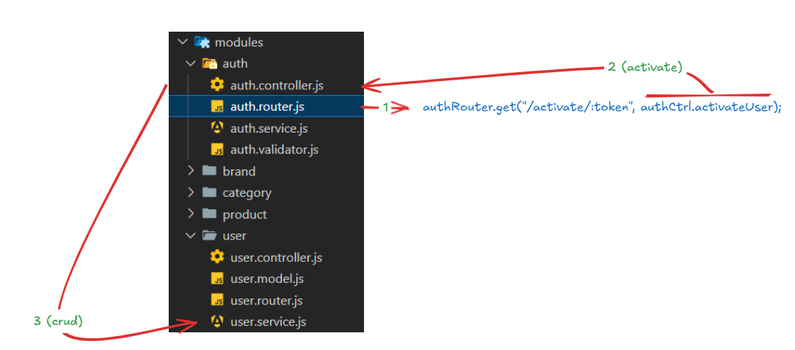

`src/modules/auth/auth.router.js`

    authRouter.get("/activate/:token", authCtrl.activateUser);

`src/modules/auth/auth.controller.js`

    activateUser = async (req, res, next) => {
        try {
                const token = req.params.token;  // OR  const {token} = req.params; 
            
                // let params = req.params;
                // const header = req.headers;
                // const query = req.query;

                // fetch user data from db by token
                const userDetail = await userSvc.getSingleUserByFilter({
                    activationToken: token,
                })

                if (!userDetail) {
                    throw {
                        status: 404,
                        message: "User associated with token not found or has been already activated...",
                        status: "NOT_FOUND",
                    }
                }

                // update user status to active
                const updatedUser = await userSvc.updateSingleUserByFilter({
                    _id: userDetail._id,
                }, {
                    status: "ACTIVE",
                    activationToken: null,
                });

                await authServ.newUserWelcomeEmail(updatedUser)

                res.json({
                    data: null,
                    message: "Your account has been activated successfully. Please login to continue ... ",
                    status: "ACTIVATED",
                    options: null,
                })

        } catch (exception) {
                console.log("Activation Error", exception);
                next(exception);
        }

    };

