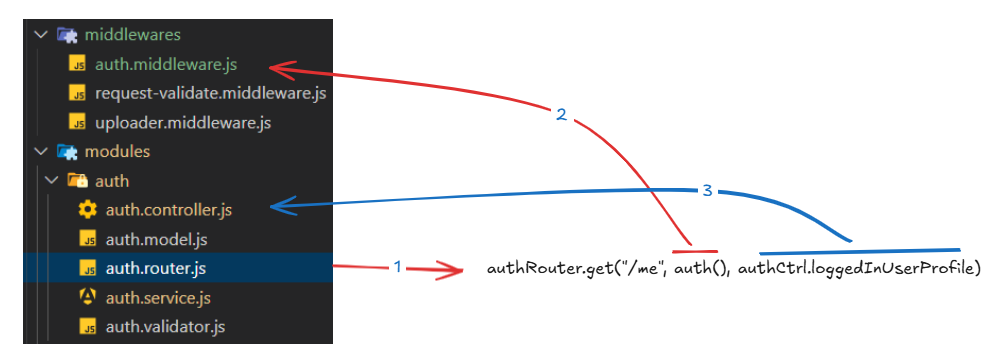

`src/modules/auth/auth.router.js`

    authRouter.get("/me", auth(), authCtrl.loggedInUserProfile) 

`src/middleware/auth.middleware.js`

    const auth = (role = null) => {
        return async (req, res, next) => {
            try {
                let token = req.headers["authorization"];

            
                if (!token) {
                    throw {
                        status: 401,
                        message: "Authorized",
                        status: "UNAUTHORIZED",
                    }
                }

                // Bearer token  => "token"
                token = token.replace("Bearer ", "");

                // db token
                const authData = await authServ.getSingleUserByFilter({
                    maskedAccessToken: token,
                })

                if (!authData) {
                    throw {
                        status: 401,
                        message: "Token not found",
                        status: "UNDEFINED_TOKEN",
                    }
                }

                // console.log("authData: ", authData);
                
                const decodedData = jwt.verify(authData.accessToken, AppConfig.jwtSecret)

                // console.log("data...: ", decodedData);

                if (decodedData.typ !== "Bearer") {
                    throw {
                        status: 401,
                        message: "Token not found",
                        code: "UNDEFINED_TOKEN",
                    }
                }
                

                let userDetail = await userSvc.getSingleUserByFilter({
                    _id: decodedData.sub,
                })

                if (!userDetail) {
                    throw {
                        status: 403,
                        message: "User not found or already being deleted from the application",      
                        status: "USER_NOT_FOUND",
                    }
                }

                userDetail = userSvc.getUserPublicProfile(userDetail);

                if (userDetail.role === USER_ROLES.ADMIN || role === null || (Array.isArray(role) && role.includes(userDetail.role))) {
                    req.loggedInUser = userDetail; 
                    next();
                } else {
                    throw {
                        status: 403,
                        message: "Access Denied",
                        status: "ACCESS_DENIED",
                    }
                }

            } catch (exception) {
                console.error("Auth Middleware Error:", exception);
                next(exception);
            }

        }
    }

`src/modules/auth/auth.controller.js`

    loggedInUserProfile = (req, res, next) => {
        res.status(200).json({
        data: req.loggedInUser,
        message: "Me route",
        status: "Success",
        options: null,
        });
    };